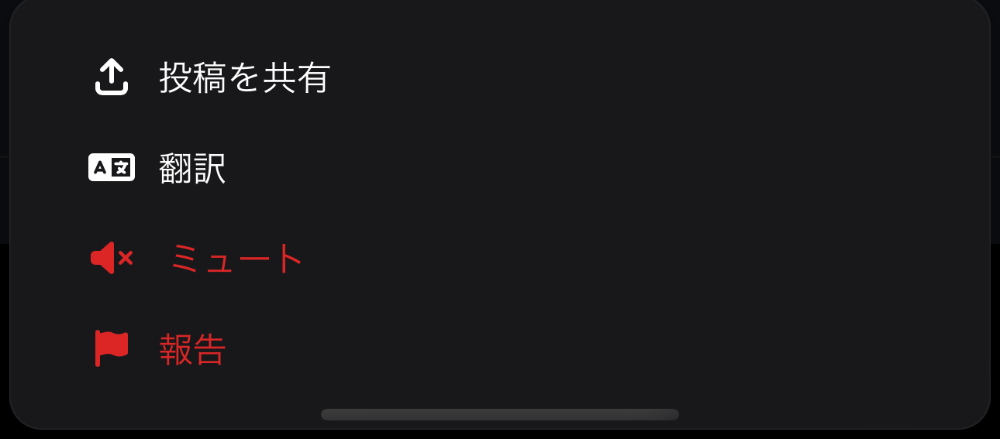

+++
title = '概要'
date = 2024-01-17T00:10:44+09:00
draft = false
url = '/docs/概要'
aliases = '/docs/'
+++

(作成中)

| 機能          | よくある質問   |
|-------------|----------|
| ミュートワード     | ログインできない |
| ブックマーク      | ブックマークが消えた |
| プッシュ通知      | バグ報告・要望したい |
| u-tab       |          |
| 複数アカウント切り替え |        |
| 翻訳機能        |        |
| 引いて更新       |        |
| その他の細かい機能   |        |

### 1.1. What is Ucho-ten?

Ucho-tenとは、PCやスマートフォンで動作するBluesky クライアント アプリケーションです。  
フォローフォロワー数、いいね・リポスト数といった、SNSから"数"を不要とし排除する特徴があります。

推奨：スマートフォンからはPWA版をご利用ください。  
PWAとは？メリットや追加方法等は[コチラ](../pwa)をご覧ください。

アクセスはこちらから▶︎ [https://ucho-ten.net/](https://ucho-ten.net/)

### 1.2. 使い方

### 基本操作

- タップ (説明は省きます)
- 投稿の上で長押し
- スワイプ  
  の3種類があります。

### 投稿の上で長押しすると

- 投稿を共有
- 翻訳
- (投稿者を)ミュート
- 投稿を報告  
  また自分の投稿であれば
- 削除  
  の操作ができます。

### スワイプすると

以下のようにスワイプすることで、フィードや画面を切り替えることができます。  

なお、Ucho-tenロゴ下にある項目が複数あれば、スワイプで切り替えることが可能です。

## 1.3 Ucho-tenの哲学

特にここ数年のSNSにおける「数」は、特にコンテンツ発信者の間で重要視されているように思います。

しかし情報を享受する人々には関係のない話です。   
にも関わらず、情報の受益者にとってソレらの要素は情報の価値を判断する指標と化している側面があります。

確かに「自分の価値観と向き合い、何が好きで何が好きでないか」を考えることは労力がかかります。  
絶えず新しい情報が次々に入ってくるSNSにおいて都度考えていては疲れてしまいます。現実的に難しいでしょう。

ただ、それを続けると、自分の評価軸を見失ってしまうことになるのではないでしょうか。

Ucho-tenはあなたが感じた「良い」と気軽に向き合い、自分の価値観で判断できる環境を用意します。  
あなたの感じたことと向き合うキッカケになれば幸いです。

開発者: [ばいそに https://bsky.app/profile/bisn.ucho-ten.net/](https://bsky.app/profile/bisn.ucho-ten.net/)