+++
title = 'PWA'
date = 2024-01-17T20:08:15+09:00
draft = false
url = '/docs/pwa'
aliases = '/docs/pwa'
+++

# PWAの追加方法について

## What is PWA?
PWAとは、Webサイトをアプリのように扱えるようにする技術です。  

## PWAのメリット
- Ucho-tenをスマホアプリのようにホーム画面に追加できる
- ブラウザを開く必要がない
- プッシュ通知が使える
- フルスクリーンだからデザインが綺麗

| ブラウザ                                                                    | PWA版                                                                |
|-------------------------------------------------------------------------|---------------------------------------------------------------------|
| 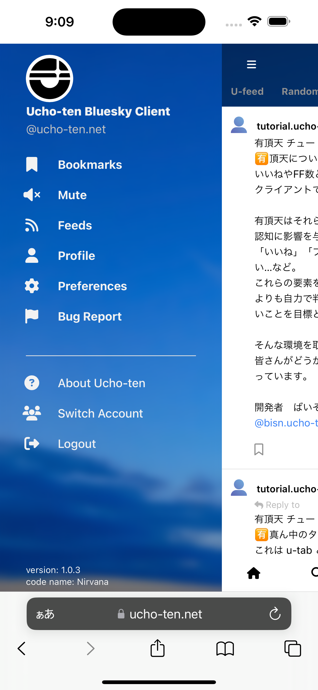 | 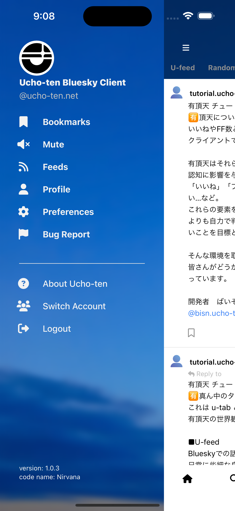 |

## PWAの追加方法

### iOS

| 手順                                       | スクリーンショット                                                          |
|------------------------------------------|--------------------------------------------------------------------|
| 1. SafariでUcho-tenにアクセスし 「共有」ボタンをタップ | 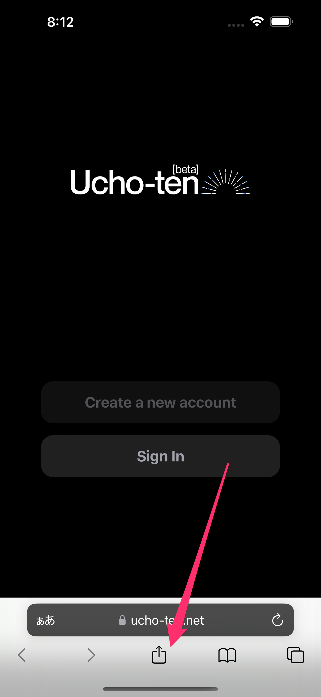 |
| 2. 「ホーム画面に追加」をタップ                           | 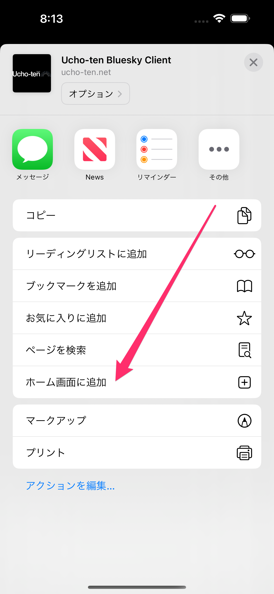 |
| 3. 「追加」をタップ                        | 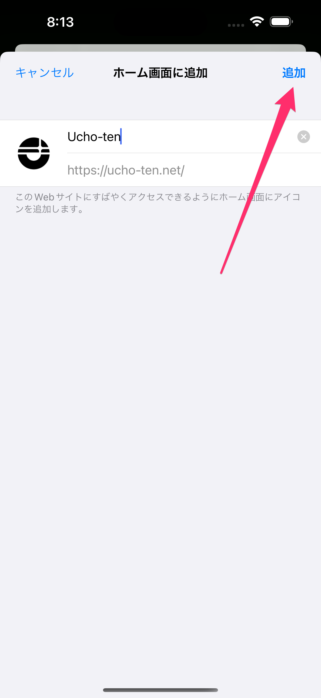 |
| 4. ホーム画面にUcho-tenが追加されます                             | 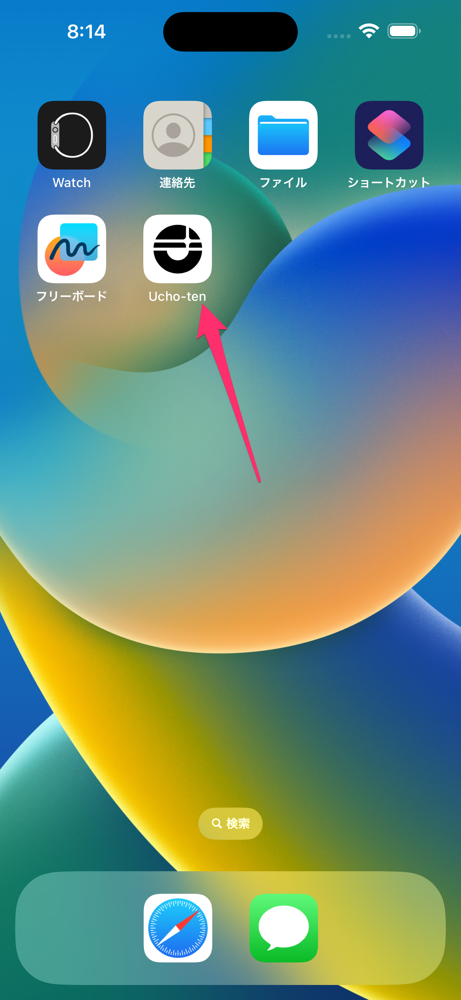 |
| 5. Ucho-tenをタップすると PWA版が起動します                 | 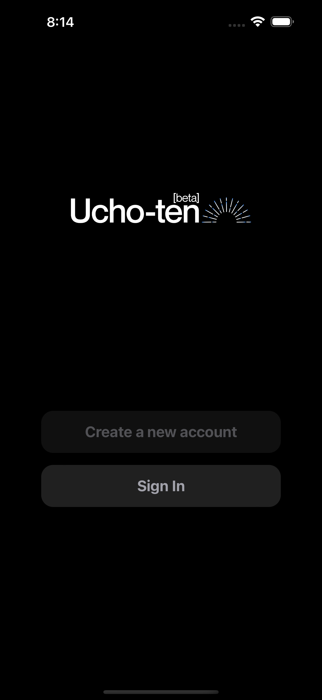 |

### Android
| 手順                                      | スクリーンショット                                                          |
|-----------------------------------------|--------------------------------------------------------------------|
| 1. ChromeでUcho-tenにアクセスし 「メニュー」をタップ | 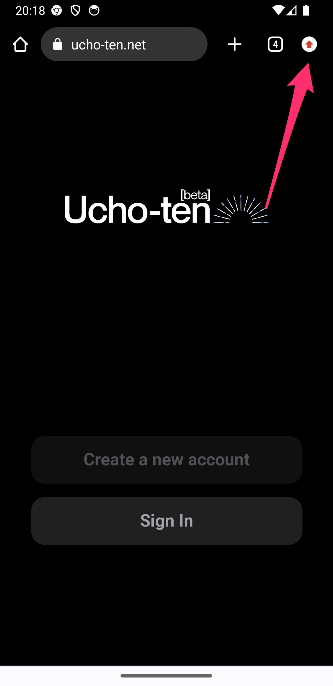 |
| 2. 「アプリをインストール」をタップ                     | 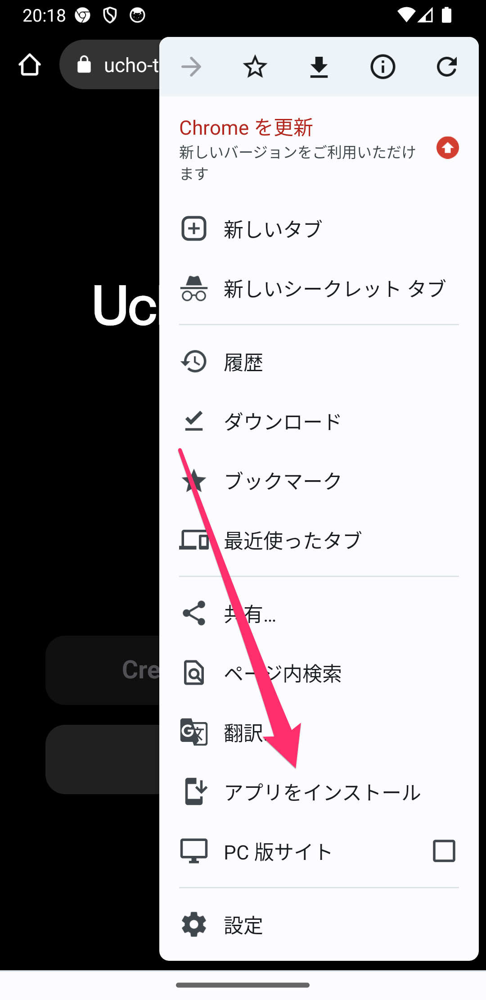 |
| 3. 「インストール」をタップ                         | 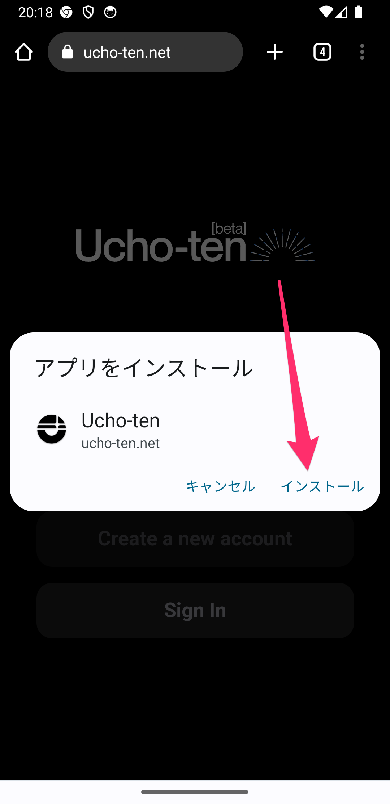 |
| 4. ホーム画面にUcho-tenが追加されます                          | 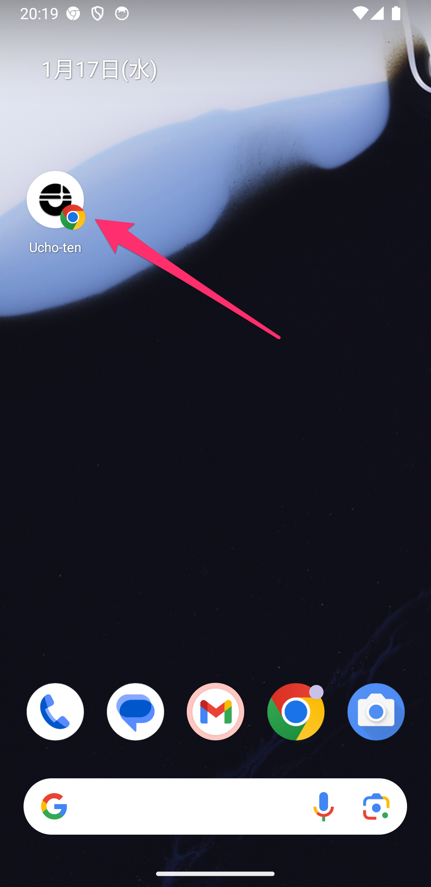 |
| 5. Ucho-tenをタップすると PWA版が起動します              | 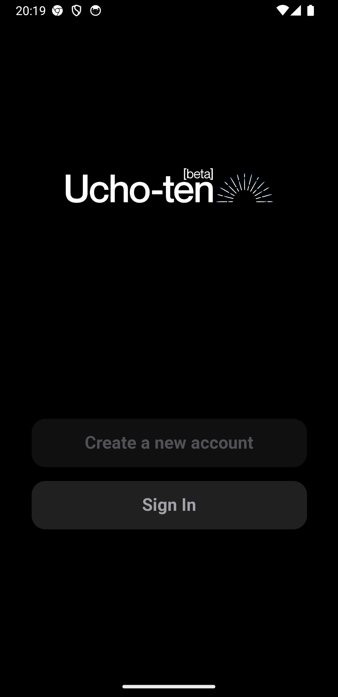 |
