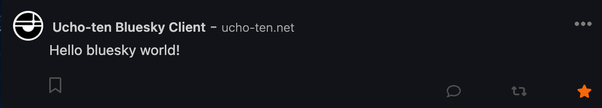

+++
title = 'ブックマーク'
date = 2024-01-20T03:32:53+09:00
draft = false
url = "/docs/ブックマーク"
+++

## What is ブックマーク?
ブックマークは気に入った投稿を保存する機能です。  
Ucho-tenでは、アカウントごとにサーバーに保存されるため、端末が違っていても同期されます。

## 登録したブックマークはどこへ？

### PC
- 画面左に位置するサイドメニューの「ブックマーク」をクリック
又は
- [コチラ](https://ucho-ten.net/bookmark/)から直接アクセスできます。 (要ログイン)

### スマートフォン
- サイドバーの「ブックマーク」をタップ

## ブックマークの使い方
### 追加
  

1. 投稿左下の「ブックマークのマーク」をタップ
2. ブックマークが追加、同期されます

### 削除
1. ブックマークから外したい投稿の、左下にある「ブックマークのマーク」をタップ
2. ブックマークが削除されます

## トラブルシューティング
### ブックマークが消えた
- [ ] ブックマークを削除していませんか？
- [ ] ブックマークを追加したアカウントとは別のアカウントでログインしていますか？

以上二つに当てはまらない場合はバグの可能性があります。  
お手数ですが、[Googleフォーム お問い合わせ](https://docs.google.com/forms/d/e/1FAIpQLScSKT_xhSkUK7d6zHIk25EQsz8A63TuFWgmMKdxleddz5QhUQ/viewform)よりご連絡ください。