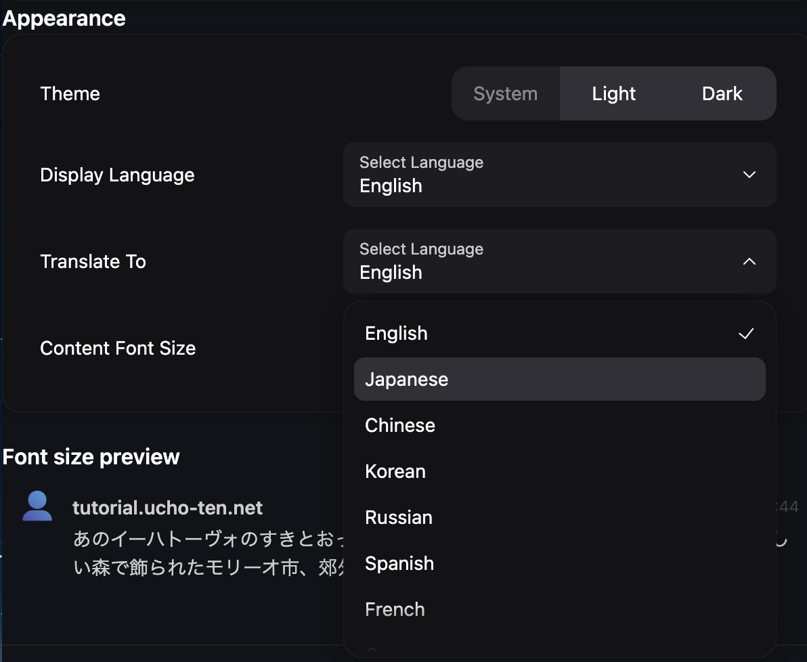
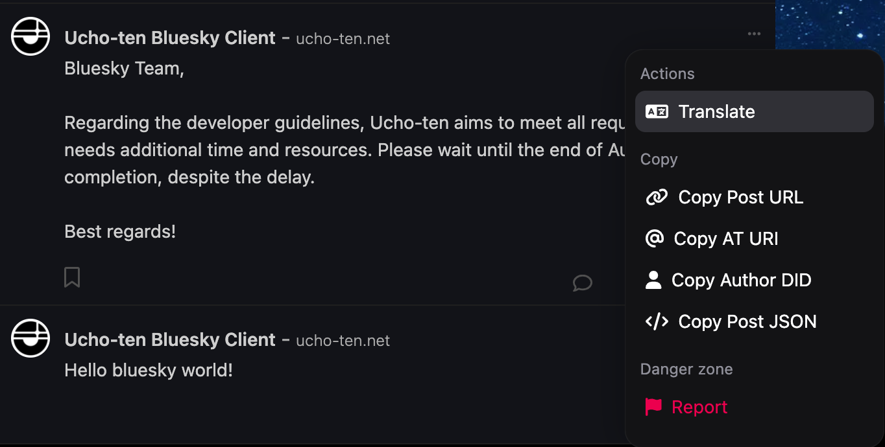
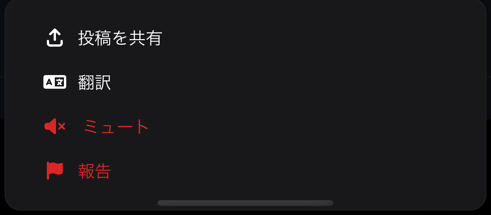

+++
title = '翻訳機能'
date = 2024-01-21T01:26:14+09:00
draft = false
url = '/docs/翻訳機能'
+++

## What is 翻訳機能?
翻訳機能とは、投稿を自動で翻訳して表示する機能です。

## 翻訳機能の設定はどこ？

### PC
1. 画面左に位置するサイドメニューの「設定」をクリック  
2. または、[コチラ](https://ucho-ten.net/settings/)から直接アクセスできます。 (要ログイン)

### スマートフォン
1. サイドバーの「設定」をタップ

## 翻訳先言語の設定方法

設定画面の外観、又はAppearanceの  
「翻訳先言語 / Translate To」から設定できます。

デフォルトでは英語に設定されているため、お好みの言語に変更してください。

## 翻訳方法

### PC
1. 対象の投稿にカーソルを合わせ、右上の「・・・」をクリック
2. 一番上の 翻訳 / Translate をクリック
3. 翻訳された投稿が表示されます

### スマートフォン
1. 対象の投稿を長押し
2. 2番目の 翻訳 / Translate をタップ
3. 翻訳された投稿が表示されます

## トラブルシューティング
### 翻訳されない
- [ ] 翻訳先言語は正しく設定されていますか？

以上に当てはまらない場合はバグの可能性があります。
お手数ですが、[Googleフォーム お問い合わせ](https://docs.google.com/forms/d/e/1FAIpQLScSKT_xhSkUK7d6zHIk25EQsz8A63TuFWgmMKdxleddz5QhUQ/viewform)よりご連絡ください。